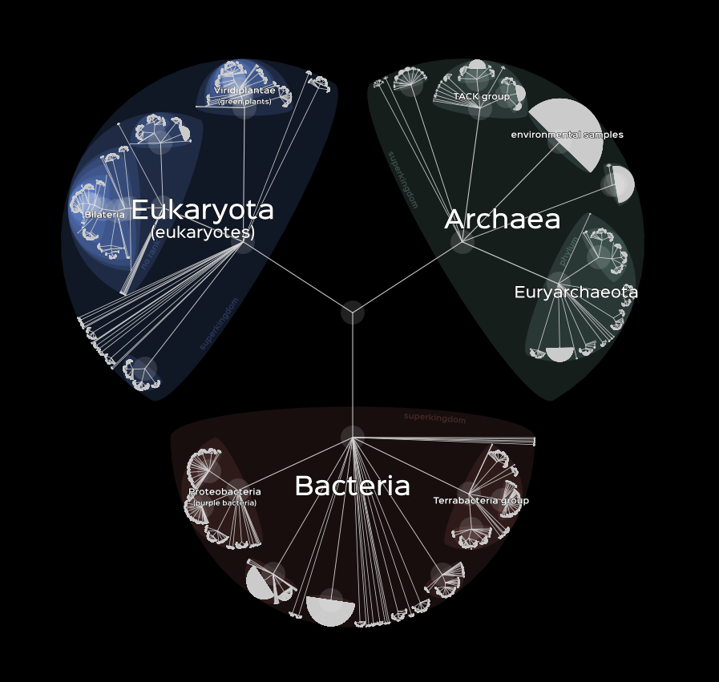
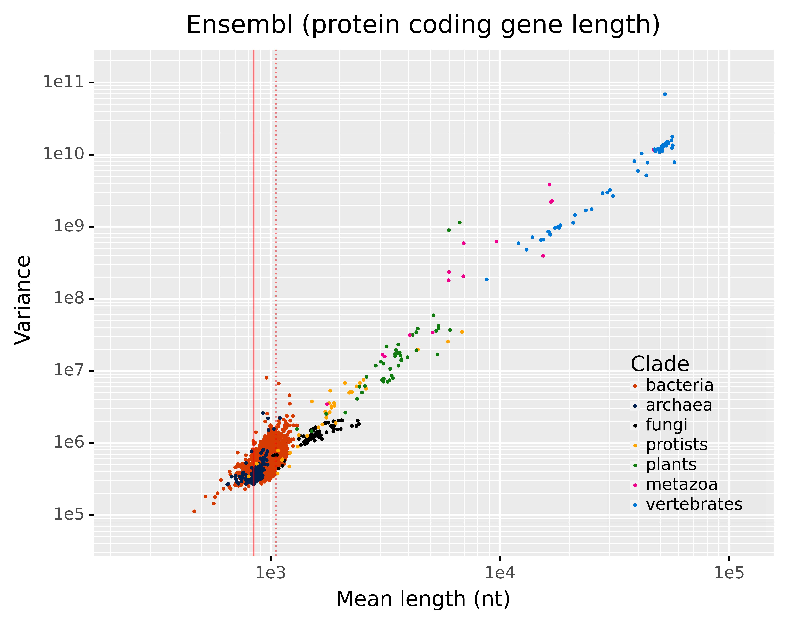
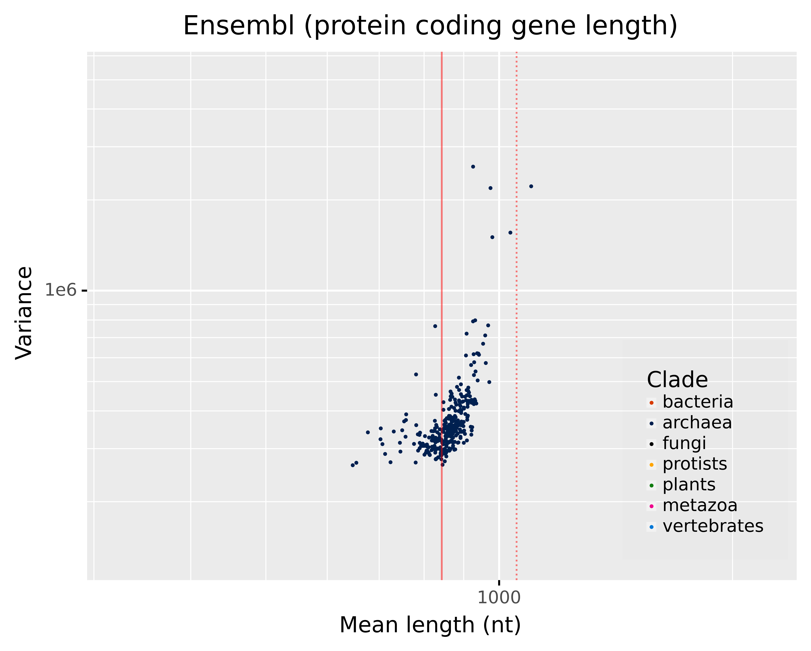
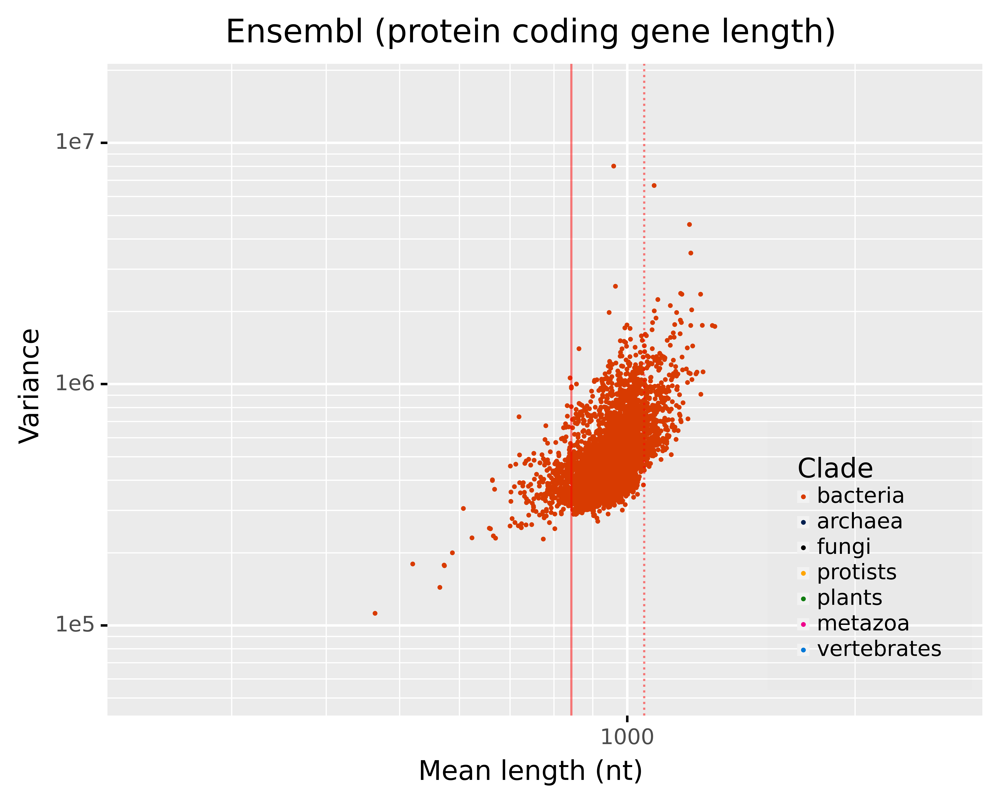
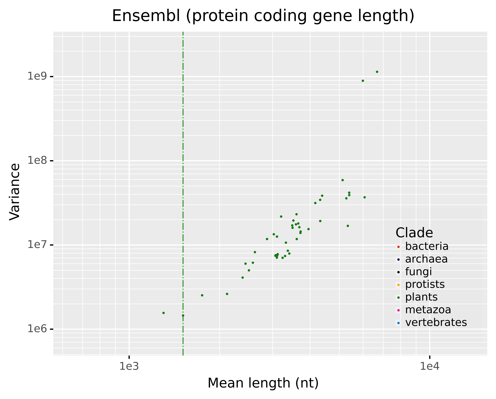
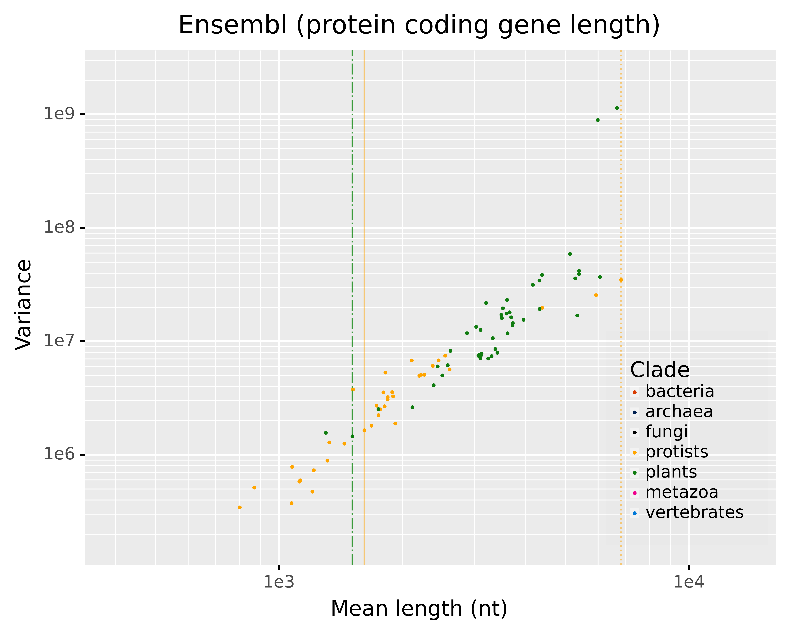
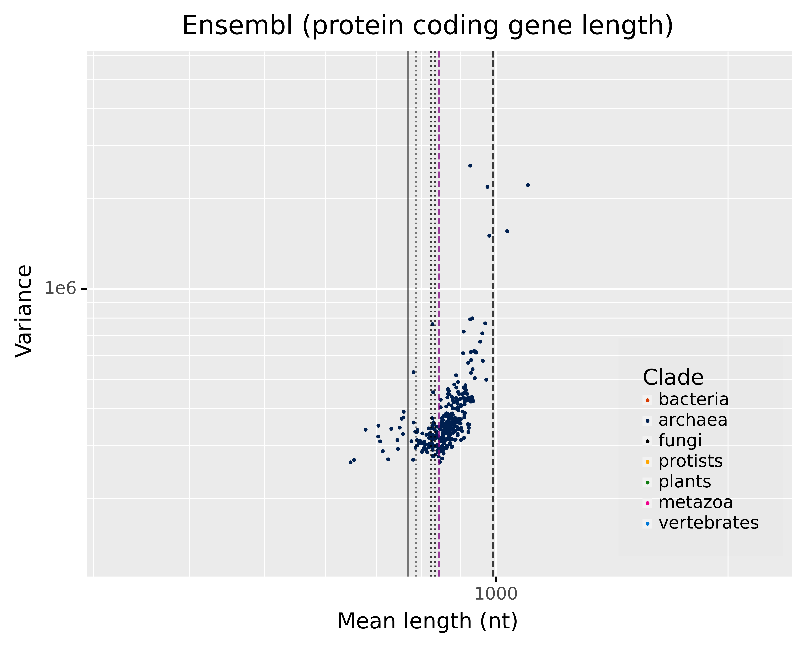

# Live as a parallel process
  

Idea. 
- The energy that a processor takes limits its capabilities, and live as a parallel process is what arised.  

The key is the frequency: For a atom computation? mutation rate? new genome (offspring)?

Processor power dissipation or processing unit power dissipation is the process in which computer processors consume electrical energy, and dissipate this energy in the form of heat due to the resistance in the electronic circuits.

$CV^{2}f$
[where C is the switched load capacitance, f is frequency, V is voltage.](https://en.wikipedia.org/wiki/Processor_power_dissipation)

# Multicelullarity documentated jumps 

```doi:10.1093/jxb/erz547
```
<pre>
When broadly defined as the ability to sustain cel-
lular congeries, estimates indicate that eukaryotic multicellu-
larity evolved over 25 times (Grosberg and Strathmann, 2007).
However, when restricted to intrinsically multicellular organisms
(IMOs, i.e. those with cell to cell signaling and a heritable
phenotype), <b>estimates narrow down to only 11 occurrences
among eukaryotes—once in </b>the Amoebozoa (dictyostelids),
once in the Animalia or Metazoa, three in the Fungi (chytrids,
ascomycetes, and basidiomycetes), and twice in each of the
three major photosynthetic eukaryotic clades (Niklas and
Newman, 2013; Niklas, 2014).
</pre>

## Plant clades
- In the line of plants there are bacterias implicates


Niklas and Newman, 2013 
<pre>
When defined simply as cellular
aggregation, a conservative estimate is that multicellularity
evolved over 25 times (Grosberg and Strathmann 2007). More
stringent definitions requiring sustained cell‐to‐cell interconnec-
tion and communication obtain an estimate of ten eukaryotic
events, that is, once in the Animalia, three in the Fungi (chytrids,
ascomycetes, and basidiomycetes), <b>and six in the three major
plant clades (twice each in the rhodophytes, stramenopiles, and
chlorobionta).</b>
</pre>

### Chlorobiaceae (Bacteria)

Status of the assembly of the genomes: Complete genome or chromosome

11 Chlorobiaceae:
**Bacteria;** Chlorobi;Chlorobia;Chlorobiales;**Chlorobiaceae**;X

| X |  num |
|---                                       |---|
| Chlorobaculum                            | 3 | 
| Chlorobium/Pelodictyon_group;Chlorobium  | 2 |
| Chlorobium/Pelodictyon_group;Pelodictyon | 2 |
| Prosthecochloris                         | 3 |
| Chloroherpeton                           | 1 |
|||
| Total                           | 11 |

#### $\mu_g$ and $\sigma^{2}_g$ in Chlorobiaceae (bacteria):

$\mu_g$ between [843.44 - 1052.11] nt. See [Data](./README.txt)



--
The multicelullarity jump is detected in Chlorobiaceae. When looking into Archaea it corresponds to a clear change in the Taylor. 

In archaea,  



[Image zoom](./archaea__chlorobiaceae_jump.png)  
Note: Esta transición, no la veía en Archeas con genomas con status distintos a "complete genome" & "chromosome".

In bacteria,  



#### Evidences of multicellularity in Chlorobiaceae 

"Generally, Chlorobium are rod or vibroid shaped and some species contain gas vesicles. They can develop as single or aggregate cells".  
[wiki](https://en.wikipedia.org/wiki/Green_sulfur_bacteria)  
See also, the wikis' phylogenetic tree.  
Nota: Las Chlorobaculum, parece que estaban antes confundidas entre las Chlorobium.  


### Rhodophyta (Plants)

Status of the assembly of the genomes: Complete genome or chromosome (48 plants)

- I only capture 1 Rhodophytes (good genomes) and it is single-cell: cyanidioschyzon_merolae ($\mu_g$=1511.3 $\sigma^{2}$=1453511.2). It is the 2nd with the shortest $mu_g$. 
- The shortest is single-cell also. 
- I check the rest (46; manually) and they are multicellular; but the chlamydomonas_reinhardtii (green algae) ($\mu_g$=5339.1 $\sigma^{2}$=16858486).
- The probability that this is by chance ~0.

In plants,  


Nota: La de la linea (dash) es la única Rhodophyta, la de la izq. es monocellular. Examino manualmente y solo veo otra monocellular en otro extremo (5339.1) un alga verde.


### Stramenopiles (Protists)

Status of the assembly of the genomes: Complete genome or chromosome (37 plants)

- I capture 4 Stramenopiles $\mu_g$[1616.5-6836.1] :no lo veo muy informativo mas allá de que 1616 cae muy cerca de la Rodophyte (red algae; última single cell de plantas. Ver la linea amarilla en el plot anterior) y de que contiene hasta el final de plantas.






  